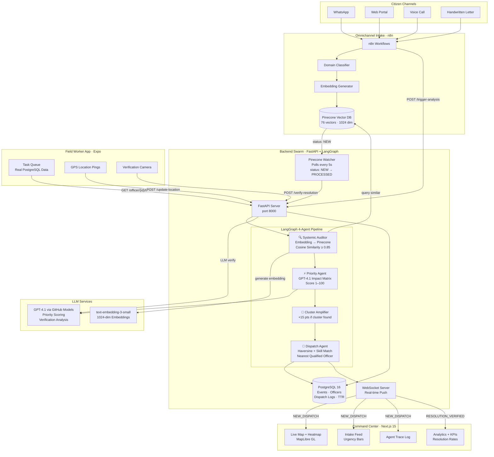

<p align="center">
  
</p>

<h1 align="center">Civix-Pulse</h1>

<p align="center">
  <strong>Zero-Bureaucracy Governance — An AI Swarm That Resolves, Not Just Records.</strong>
</p>

<p align="center">
  
  
  
  
  
</p>

---

## The Problem

India's public grievance system processes over **30 lakh complaints per year** across municipal, state, and central portals. The average time-to-resolution is **16 days**, and in many jurisdictions it exceeds 45 days. Three structural failures drive this:

| Failure | Reality |
|---------|---------|
| **Siloed Departments** | A water-pressure complaint, a sewage overflow, and a road collapse are filed to three different departments — even when all stem from the same burst pipeline. |
| **Ticket Mentality** | Complaints are treated as tickets to be *closed*, not insights to be *solved*. The metric is closure rate, not citizen outcome. |
| **Zero Feedback Loop** | Citizens receive no status updates, no verification of resolution, and no channel to confirm the fix actually worked. |

Civix-Pulse replaces this with an **autonomous multi-agent AI swarm** that ingests complaints from any channel, identifies systemic root causes through cluster analysis, dispatches field officers with spatial intelligence, and verifies resolution through AI-powered photo verification — all in real time.

> **See also:** [Product Requirements Document](docs/PRD.md) for full problem analysis and success metrics.

---

## How It Works

Civix-Pulse operates as an **8-step continuous pipeline** from citizen complaint to verified resolution:

1. **Citizen files a complaint** via WhatsApp, web portal, voice call, or handwritten letter.
2. **Omnichannel Intake (n8n)** processes the raw input — OCR for handwritten text, Bhashini STT for Hindi voice, LLM classification for category and intent — and writes the structured event to Pinecone.
3. **n8n triggers the Backend** via webhook: `POST /api/v1/trigger-analysis?event_id=<uuid>`.
4. **Cluster Analysis** fetches the event embedding from Pinecone and checks for semantic duplicates (similarity > 0.85, within 2 km, last 12 hours). If a cluster exists, the event is collapsed into the root cause.
5. **Priority Agent (LangChain)** scores the event using an Impact Matrix — producing an `impact_score` (1–100) and `severity_color` for triage.
6. **Spatial Matchmaker** queries PostGIS for the nearest available field officer whose domain expertise matches the complaint category.
7. **WebSocket broadcasts `NEW_DISPATCH`** to the Command Center dashboard and the Field Worker mobile app simultaneously.
8. **Officer resolves the issue**, uploads a verification photo → Gemini Flash Vision confirms resolution → case is closed and the citizen receives a WhatsApp notification.

> **See also:** [Features](docs/features.md) for detailed capability descriptions and the 5-minute demo script.

---

## Architecture



---

## Quick Start

### Prerequisites

- Python 3.12+ with `pip`
- Node.js 18+ with `npm`
- PostgreSQL 16 running locally
- API keys: `GITHUB_MODELS_API_KEY` (GitHub PAT), `PINECONE_API_KEY`

### 1. Clone & Configure

```bash
git clone https://github.com/emmanuelmj/civix.git
cd civix
cp backend/.env.example backend/.env
# Add your API keys to backend/.env
```

### 2. Database Setup

```bash
psql -U postgres -c "CREATE DATABASE civix_pulse;"
psql -U postgres -d civix_pulse -f backend/database/schema.sql
```

### 3. Launch All Services

```bash
# Terminal 1 — Backend
cd backend && pip install -r requirements.txt
python -m uvicorn main:app --host 0.0.0.0 --port 8000

# Terminal 2 — Command Center Dashboard
cd command-center && npm install
npx next dev --turbopack -p 3000

# Terminal 3 — Field Worker App
cd field-worker-app && npm install
npx expo start --web --port 3001
```

### 4. Docker Compose (Alternative)

```bash
docker compose up --build
```

| Service | URL |
|---------|-----|
| Backend API | `http://localhost:8000` |
| API Docs (Swagger) | `http://localhost:8000/docs` |
| Command Center | `http://localhost:3000` |
| Field Worker App | `http://localhost:3001` |
| PostgreSQL | `localhost:5432` |

### 5. Trigger a Test Event

```bash
curl -X POST http://localhost:8000/api/v1/trigger-analysis \
  -H "Content-Type: application/json" \
  -d '{
    "event_id": "test-001",
    "translated_description": "Sewage overflow near Charminar for 3 days",
    "domain": "WATER",
    "coordinates": {"lat": 17.3616, "lng": 78.4747}
  }'
```

---

## Team Domains

| Domain | Directory | Owner | Responsibilities |
|--------|-----------|-------|-------------------|
| **Backend & Swarm Logic** | `backend/` | Dev 1 (Lead) | FastAPI server, LangChain agents, PostGIS spatial queries, WebSocket broadcasts, Browser-Use portal filing |
| **Omnichannel Intake** | `omnichannel-intake/` | Dev 2 | n8n workflow orchestration, Pinecone ingestion, OCR/STT pipelines, LLM prompt templates |
| **Command Center** | `command-center/` | Dev 3 | Next.js 15 dashboard, live heatmap, agent activity log, executive metrics, WebSocket client |
| **Field Worker App** | `field-worker-app/` | Dev 4 | Expo React Native mobile app, GPS location pings, camera-based verification uploads |

---

## Documentation

| Document | Description |
|----------|-------------|
| [Features](docs/features.md) | Complete feature catalog (Tier 1–3), capability details, and 5-minute demo script |
| [Product Requirements](docs/PRD.md) | Executive summary, user personas, functional & non-functional requirements, social impact thesis |
| [AGENTS.md](AGENTS.md) | AI coding agent context — architecture constraints, style rules, and tooling guidance |

---

## The Paradigm Shift

| Dimension | Legacy Grievance Systems | Civix-Pulse |
|-----------|--------------------------|-------------|
| **Intake** | Single-channel web forms | Omnichannel — WhatsApp, voice, handwritten letters, web |
| **Processing** | Manual triage by clerks | Autonomous AI Priority Agent with Impact Matrix |
| **Root Cause** | Each complaint is an island | Cluster Analysis collapses 50 complaints into 1 root cause |
| **Assignment** | Round-robin or manual | Spatial Matchmaker — nearest officer with domain expertise |
| **Verification** | Self-reported closure | AI Vision verification of resolution photos |
| **Feedback** | None | Automated WhatsApp notification with resolution proof |
| **Analytics** | Monthly PDF reports | Real-time heatmaps, leaderboards, anomaly detection |
| **Portal Filing** | Manual data entry | Browser-Use autonomously files on government portals |

---

## Tech Stack

| Layer | Technology |
|-------|------------|
| Backend | Python 3.12 · FastAPI · LangGraph · asyncpg |
| AI Agents | LangGraph 4-node pipeline (Auditor → Priority → Amplifier → Dispatch) |
| LLMs | GPT-4.1 via GitHub Models API (scoring + verification) |
| Embeddings | text-embedding-3-small (1024-dim, on-the-fly cluster search) |
| Vector DB | Pinecone (semantic clustering, status-flag watcher) |
| Database | PostgreSQL 16 (events, officers, dispatch logs, auto TTR) |
| Frontend | Next.js 15 · Tailwind CSS · shadcn/ui · TypeScript · MapLibre GL |
| Mobile | Expo (React Native) · Camera verification · GPS pings |
| Ingestion | n8n (webhooks, WhatsApp, domain classification) |
| Real-time | WebSocket (instant dashboard updates) |
| Infrastructure | Docker Compose |

---

## License

MIT — see [LICENSE](LICENSE).

---

<p align="center">
  <strong>Civix-Pulse</strong> — From Complaint to Resolution, Autonomously.<br/>
  Built for AI4Impact 2026 · PS 6 · Agentic Governance & Grievance Resolution Swarm
</p>
