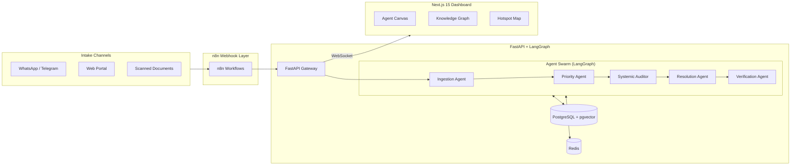

<div align="center">

# Civix-Pulse

**Agentic Governance & Grievance Resolution Swarm**

*From reactive ticket-closing to intelligence-driven civic governance.*

[](LICENSE)
[](https://python.org)
[](https://nextjs.org)
[](https://fastapi.tiangolo.com)
[](https://langchain-ai.github.io/langgraph/)

</div>

---

## The Problem

India processes over **30 lakh public grievances annually**. The average resolution time is **16 days**. Complaints are siloed across departments, treated as isolated tickets, and millions of citizens — particularly the elderly, disabled, and rural poor — never file at all.

**The result:** governance is reactive, data is fragmented, and systemic failures go undetected until they become crises.

Civix-Pulse reframes grievances from *tickets to close* into *intelligence to act on*.

---

## What Civix-Pulse Does

Civix-Pulse is a **multi-agent AI swarm** that autonomously ingests, triages, correlates, and resolves citizen grievances — and detects problems before citizens even report them.

```
Citizen Voice Note (Hindi) ──┐
Handwritten Letter (OCR) ────┤──→ Agent Swarm ──→ Root-Cause Found ──→ Auto-Filed on Portal
Web / WhatsApp Text ─────────┘                                        ──→ Officer Dispatched
                                                                       ──→ AI Verifies Fix
                                                                       ──→ SLA Breach → Auto-Appeal
```

### Core Capabilities

| Capability | Description |
|---|---|
| **Autonomous Portal Filing** | A computer-use agent opens a government portal in a headless browser, fills the work-order form, and submits — no API required. |
| **Multilingual Voice Intake** | Hindi voice complaints via WhatsApp → Bhashini STT → translated, classified, routed. |
| **Root-Cause Intelligence** | Semantic clustering links 50 scattered complaints to one failing pump station. |
| **AI-Verified Resolution** | Vision model confirms a pothole is actually filled before the ticket closes. |
| **Policy RAG with Citations** | Auto-cites relevant government policies, RTI acts, and SLA deadlines for every complaint. |
| **Auto-Appeal on SLA Breach** | System drafts a legal appeal and triggers mock compensation when the government misses its deadline. |

> For the complete tier-wise feature breakdown, see **[docs/features.md](docs/features.md)**.

---

## Architecture Overview



> For detailed system design and data flow diagrams, see **[docs/ARCHITECTURE.md](docs/ARCHITECTURE.md)**.

---

## Tech Stack

| Layer | Technology | Rationale |
|---|---|---|
| **Frontend** | Next.js 15, Tailwind CSS, shadcn/ui | App Router for server components; shadcn for enterprise-grade UI primitives. |
| **Backend** | Python 3.12, FastAPI | Async-native, type-safe, OpenAPI auto-documentation. |
| **Agent Orchestration** | LangGraph | Cyclic state machines for complex multi-agent workflows with built-in persistence. |
| **Embeddings & Search** | PostgreSQL + pgvector | Vector similarity search for duplicate detection and semantic clustering. |
| **Webhook Ingestion** | n8n | Visual workflow automation for multi-source intake without custom connectors. |
| **Vision & Language** | Claude Sonnet, Gemini Flash, Bhashini | Multimodal reasoning, cost-efficient vision, and Indian-language STT. |
| **Browser Automation** | Browser-Use + Playwright | Computer-use agent for zero-API government portal integration. |
| **Infrastructure** | Docker Compose | Lightweight local deployment optimized for constrained hardware. |

> For the full rationale behind each technology choice, see **[docs/TECHSTACK.md](docs/TECHSTACK.md)**.

---

## Quick Start

### Prerequisites

- Docker & Docker Compose
- API keys: Anthropic, Google AI Studio, Bhashini (optional)

### Run Locally

```bash
# Clone the repository
git clone https://github.com/emmanuelmj/civix.git
cd civix

# Configure environment variables
cp .env.example .env
# Edit .env with your API keys

# Launch all services
docker compose up --build
```

| Service | URL |
|---|---|
| Dashboard | `http://localhost:3000` |
| API Gateway | `http://localhost:8000` |
| API Docs | `http://localhost:8000/docs` |
| n8n Workflows | `http://localhost:5678` |

> For exhaustive setup instructions, see **[docs/SETUP.md](docs/SETUP.md)**.

---

## Documentation

| Document | Description |
|---|---|
| **[FEATURES.md](docs/features.md)** | Tier-wise feature roadmap with build order and demo script. |
| **[PRD.md](docs/PRD.md)** | Product Requirements — social impact thesis and enterprise workflow gap. |
| **[TRD.md](docs/TRD.md)** | Technical Requirements — scalability, data governance, and audit compliance. |
| **[TECHSTACK.md](docs/TECHSTACK.md)** | Technology selection rationale for every layer. |
| **[ARCHITECTURE.md](docs/ARCHITECTURE.md)** | System design with Mermaid.js data flow diagrams. |
| **[AGENT_SWARM.md](docs/AGENT_SWARM.md)** | LangGraph node specifications — Ingestion, Priority, Auditor, Resolution, Verification. |
| **[API_SPEC.md](docs/API_SPEC.md)** | FastAPI endpoint contracts with request/response payloads. |
| **[REPO_STRUCTURE.md](docs/REPO_STRUCTURE.md)** | Folder tree with per-directory explanations. |
| **[SETUP.md](docs/SETUP.md)** | Step-by-step local execution guide using Docker. |

---

## The Paradigm Shift

Most civic-tech platforms digitize the complaint box. Civix-Pulse replaces it.

| Traditional System | Civix-Pulse |
|---|---|
| Citizen must file a complaint | Voice-first, multilingual intake via WhatsApp |
| Ticket routed to one department | Root-cause analysis spans all departments |
| Closed when officer says "done" | Closed when AI vision confirms resolution |
| SLA breach = nothing happens | SLA breach = auto-appeal + compensation |
| Government portal needs API | Computer-use agent fills the form autonomously |
| Hindi speaker excluded | Bhashini-powered regional language support |

---

## Team

**Team Vertex** — AI4Impact Hackathon 2026

---

## License

This project is licensed under the MIT License. See [LICENSE](LICENSE) for details.

---

<div align="center">

*We don't route tickets. We detect, file, resolve, and penalize.*

</div>
