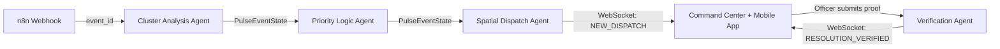
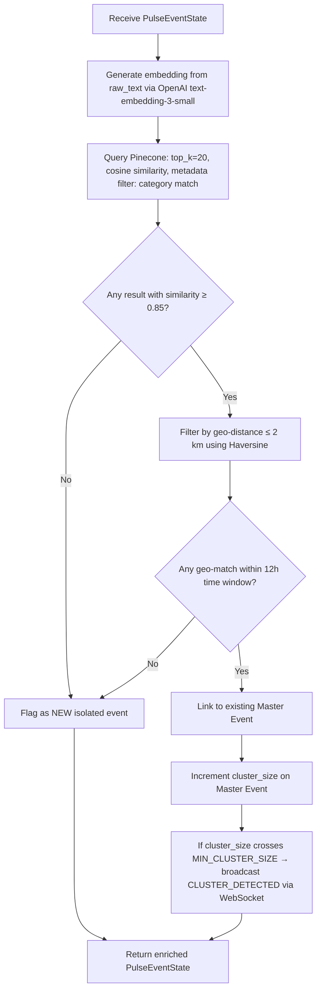
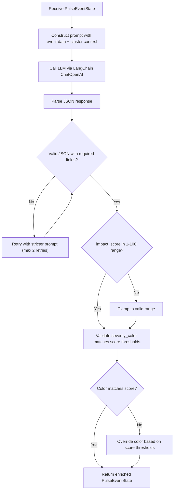
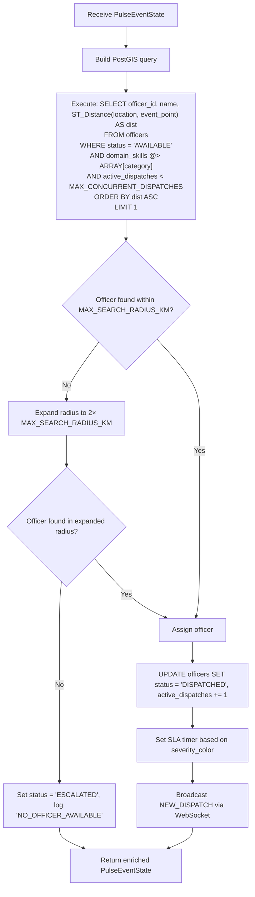
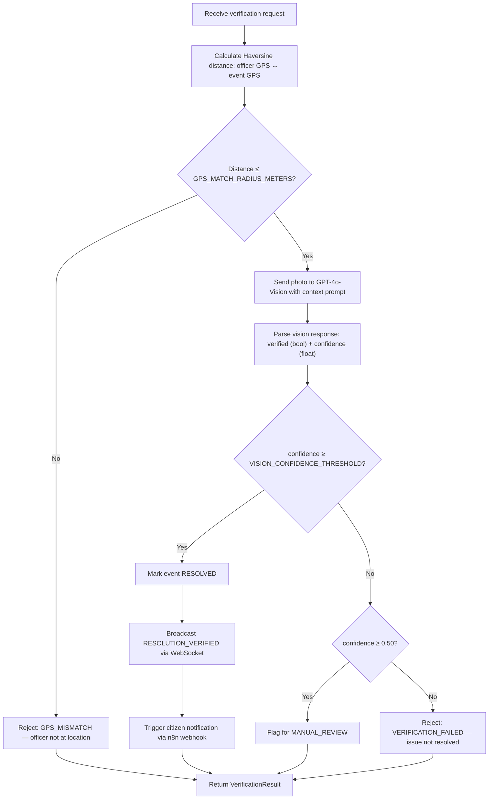

# Civix-Pulse — Agent Swarm Specification

> **Version:** 1.0.0 · **Last updated:** 2025-07-14
> **Owner:** Dev 1 (Backend Lead) · **Related:** [API_SPEC.md](./API_SPEC.md) · [ARCHITECTURE.md](./ARCHITECTURE.md) · [features.md](./features.md)

---

## Table of Contents

1. [Overview](#overview)
2. [Shared State Schema](#shared-state-schema)
3. [Inter-Agent Communication Pattern](#inter-agent-communication-pattern)
4. [Trace / Audit Emission Pattern](#trace--audit-emission-pattern)
5. [Agent 1 — Cluster Analysis Agent](#agent-1--cluster-analysis-agent)
6. [Agent 2 — Priority Logic Agent](#agent-2--priority-logic-agent)
7. [Agent 3 — Spatial Dispatch Agent](#agent-3--spatial-dispatch-agent)
8. [Agent 4 — Verification Agent](#agent-4--verification-agent)

---

## Overview

Civix-Pulse operates a **4-agent sequential pipeline** (not a cyclic graph). Each agent receives a shared `PulseEventState` dict, enriches it, and passes it to the next stage. The pipeline is triggered when Dev 2's n8n workflow hits `POST /api/v1/trigger-analysis` (see [API_SPEC.md](./API_SPEC.md#1-post-apiv1trigger-analysis)).

```
n8n webhook → Cluster Analysis → Priority Logic → Spatial Dispatch → [WebSocket broadcast]
                                                                         ↓
                                                          Verification (async, officer-initiated)
```

### Design Principles

| Principle | Implementation |
|---|---|
| **Deterministic routing** | Sequential pipeline — no conditional branching between agents |
| **Typed contracts** | Every agent input/output is a Python `TypedDict` |
| **Full auditability** | Every agent emits a `TraceEntry` with reasoning, latency, and model metadata |
| **Fail-safe defaults** | On failure, events are flagged for manual review — never silently dropped |

---

## Shared State Schema

All agents read from and write to a single `PulseEventState` dictionary threaded through the pipeline.

```python
from typing import TypedDict, Optional
from datetime import datetime

class Coordinates(TypedDict):
    lat: float
    lng: float

class TraceEntry(TypedDict):
    agent_name: str          # e.g. "cluster_analysis"
    started_at: str          # ISO 8601
    completed_at: str        # ISO 8601
    latency_ms: int
    reasoning: str           # human-readable explanation of decision
    model: Optional[str]     # LLM model used, if any
    error: Optional[str]     # error message, if any

class MasterEventLink(TypedDict):
    master_event_id: str
    similarity_score: float  # cosine similarity (0.0–1.0)
    cluster_size: int        # total events in the cluster

class OfficerAssignment(TypedDict):
    officer_id: str          # e.g. "OP-441"
    name: str
    current_lat: float
    current_lng: float
    distance_km: float       # distance from event
    domain_match: str        # matched domain skill

class VerificationResult(TypedDict):
    verified: bool
    confidence: float        # 0.0–1.0
    gps_match: bool
    vision_analysis: str     # GPT-4o-Vision explanation
    photo_url: str
    resolved_at: Optional[str]

class PulseEventState(TypedDict):
    # --- Immutable (set at ingestion) ---
    event_id: str                            # UUID v4
    source: str                              # "311_CALL" | "TWITTER" | "WHATSAPP" | "LETTER_OCR" | "VOICE"
    raw_text: str                            # original complaint text
    category: str                            # "MUNICIPAL" | "ELECTRICAL" | "WATER" | "SANITATION" | "ROADS"
    coordinates: Coordinates
    citizen_id: Optional[str]
    submitted_at: str                        # ISO 8601

    # --- Enriched by Cluster Analysis Agent ---
    is_clustered: bool
    master_event: Optional[MasterEventLink]

    # --- Enriched by Priority Logic Agent ---
    impact_score: Optional[int]              # 1–100
    severity_color: Optional[str]            # "Yellow" | "Orange" | "Red"
    priority_reasoning: Optional[str]        # LLM explanation

    # --- Enriched by Spatial Dispatch Agent ---
    assigned_officer: Optional[OfficerAssignment]
    dispatch_status: str                     # "PENDING" | "DISPATCHED" | "ACKNOWLEDGED" | "EN_ROUTE"

    # --- Enriched by Verification Agent ---
    verification: Optional[VerificationResult]
    status: str                              # "NEW" | "ANALYZING" | "DISPATCHED" | "IN_PROGRESS" | "RESOLVED" | "ESCALATED"

    # --- Audit trail ---
    traces: list[TraceEntry]
    created_at: str                          # ISO 8601
    updated_at: str                          # ISO 8601
```

---

## Inter-Agent Communication Pattern

The pipeline is **strictly sequential**. There is no conditional fan-out or cyclic feedback.



### Execution Model

| Step | Trigger | Mode |
|---|---|---|
| Agents 1 → 2 → 3 | `POST /api/v1/trigger-analysis` | **Synchronous** — single request, sequential pipeline |
| Agent 4 | `POST /api/v1/officer/verify-resolution` | **Asynchronous** — officer-initiated, decoupled |

### State Passing

Each agent function receives the full `PulseEventState` dict and returns a mutated copy:

```python
async def run_pipeline(event_id: str) -> PulseEventState:
    state = await fetch_event_from_pinecone(event_id)
    state = await cluster_analysis_agent(state)
    state = await priority_logic_agent(state)
    state = await spatial_dispatch_agent(state)
    await broadcast_dispatch(state)        # WebSocket
    await persist_state(state)             # PostgreSQL / PostGIS
    return state
```

---

## Trace / Audit Emission Pattern

Every agent appends a `TraceEntry` to `state["traces"]` before returning. This powers:

- The **Swarm Log** in the Command Center dashboard (Dev 3)
- Post-incident auditing and SLA reporting
- LLM prompt debugging

### Trace Template

```python
import time
from datetime import datetime, timezone

def create_trace(agent_name: str) -> dict:
    return {
        "agent_name": agent_name,
        "started_at": datetime.now(timezone.utc).isoformat(),
        "completed_at": None,
        "latency_ms": None,
        "reasoning": "",
        "model": None,
        "error": None,
    }

def finalize_trace(trace: dict, reasoning: str, model: str | None = None) -> dict:
    now = datetime.now(timezone.utc)
    started = datetime.fromisoformat(trace["started_at"])
    trace["completed_at"] = now.isoformat()
    trace["latency_ms"] = int((now - started).total_seconds() * 1000)
    trace["reasoning"] = reasoning
    trace["model"] = model
    return trace
```

---

## Agent 1 — Cluster Analysis Agent

### Purpose

Determines whether an incoming grievance is part of an existing **systemic cluster** (e.g., 50 low-water-pressure complaints pointing to a single pumping station failure) or is a new isolated event.

### Inputs

```python
class ClusterAnalysisInput(TypedDict):
    event_id: str
    raw_text: str
    category: str
    coordinates: Coordinates
    submitted_at: str
```

### Configuration Parameters

| Parameter | Default | Description |
|---|---|---|
| `SIMILARITY_THRESHOLD` | `0.85` | Minimum cosine similarity for cluster match |
| `GEO_RADIUS_KM` | `2.0` | Maximum geographic radius for cluster membership |
| `TIME_WINDOW_HOURS` | `12` | Events older than this are excluded from cluster matching |
| `MIN_CLUSTER_SIZE` | `3` | Minimum events to constitute a "systemic" cluster |
| `PINECONE_TOP_K` | `20` | Number of nearest neighbors to retrieve |

### Processing Logic



### Output Schema

The agent enriches `PulseEventState` with:

```python
class ClusterAnalysisOutput(TypedDict):
    is_clustered: bool
    master_event: Optional[MasterEventLink]  # None if is_clustered is False
```

### Failure Modes

| Failure | Cause | Handling |
|---|---|---|
| Pinecone timeout | Network / rate limit | Retry 2× with exponential backoff (1s, 3s). On failure, set `is_clustered=False` and continue pipeline. Log warning in trace. |
| Embedding API error | OpenAI outage | Same retry policy. On failure, skip clustering and continue. |
| Zero results from Pinecone | New category or cold start | Normal path — treat as isolated event. |

---

## Agent 2 — Priority Logic Agent

### Purpose

Evaluates the severity and societal impact of a grievance using an LLM-as-a-judge pattern. The LLM assumes the role of a **Senior City Planner** and produces a structured `impact_score` (1–100) and `severity_color`.

### Inputs

```python
class PriorityLogicInput(TypedDict):
    event_id: str
    raw_text: str
    category: str
    coordinates: Coordinates
    is_clustered: bool
    master_event: Optional[MasterEventLink]
```

### Configuration Parameters

| Parameter | Default | Description |
|---|---|---|
| `LLM_MODEL` | `gpt-4o` | Model used for priority assessment |
| `LLM_TEMPERATURE` | `0.1` | Low temperature for deterministic scoring |
| `LLM_MAX_TOKENS` | `512` | Max response length |
| `LLM_TIMEOUT_SECONDS` | `15` | Request timeout |
| `SCORE_RED_THRESHOLD` | `75` | Scores ≥ 75 → Red |
| `SCORE_ORANGE_THRESHOLD` | `40` | Scores 40–74 → Orange |
| `SCORE_YELLOW_THRESHOLD` | `1` | Scores 1–39 → Yellow |

### LLM Prompt (Exact Text)

```
SYSTEM:
You are a Senior City Planner with 20 years of experience in urban crisis management
for a city of 10 million people. Your job is to evaluate the severity of a citizen
grievance report and assign a priority score.

SCORING RULES:
- impact_score: integer from 1 (trivial) to 100 (life-threatening emergency)
- severity_color: "Red" (75-100), "Orange" (40-74), "Yellow" (1-39)

SCORING FACTORS (weight each):
1. LIFE SAFETY: Does this pose immediate danger to human life? (+40 max)
2. POPULATION AFFECTED: How many citizens are impacted? (+25 max)
3. VULNERABLE GROUPS: Are children, elderly, or disabled people at risk? (+15 max)
4. CASCADING RISK: Could this escalate into a larger crisis? (+10 max)
5. TIME SENSITIVITY: Will delay worsen the situation significantly? (+10 max)

CONTEXT BOOST:
- If this event is part of a cluster of {cluster_size} similar complaints, increase
  the score by 10-20 points (systemic issues are more severe).

Respond ONLY with valid JSON. No markdown, no explanation.

USER:
Grievance Report:
- Event ID: {event_id}
- Category: {category}
- Location: ({lat}, {lng})
- Is Part of Cluster: {is_clustered} (cluster size: {cluster_size})
- Complaint Text: "{raw_text}"

Respond with:
{{
  "impact_score": <int 1-100>,
  "severity_color": "<Red|Orange|Yellow>",
  "reasoning": "<2-3 sentence explanation of scoring factors>"
}}
```

### Processing Logic



### Output Schema

```python
class PriorityLogicOutput(TypedDict):
    impact_score: int            # 1–100
    severity_color: str          # "Yellow" | "Orange" | "Red"
    priority_reasoning: str      # LLM-generated explanation
```

### Failure Modes

| Failure | Cause | Handling |
|---|---|---|
| LLM timeout (> 15s) | OpenAI latency spike | Retry 2× with 5s backoff. On exhaustion, assign default `impact_score=50`, `severity_color="Orange"`, log `"LLM_TIMEOUT_FALLBACK"` in trace. |
| Malformed JSON response | LLM hallucination | Retry with appended instruction: `"You MUST respond with valid JSON only."` Up to 2 retries. |
| Score out of range | LLM non-compliance | Clamp to `[1, 100]` and override `severity_color` based on score thresholds. |
| Color/score mismatch | LLM inconsistency | Server-side override — score thresholds are authoritative. |

---

## Agent 3 — Spatial Dispatch Agent

### Purpose

Finds the nearest available field officer whose domain expertise matches the event category, assigns the dispatch, and broadcasts the assignment via WebSocket.

### Inputs

```python
class SpatialDispatchInput(TypedDict):
    event_id: str
    category: str
    coordinates: Coordinates
    impact_score: int
    severity_color: str
```

### Configuration Parameters

| Parameter | Default | Description |
|---|---|---|
| `MAX_SEARCH_RADIUS_KM` | `10.0` | Maximum radius to search for available officers |
| `DISPATCH_TIMEOUT_SECONDS` | `300` | Time before unacknowledged dispatch triggers escalation |
| `MAX_CONCURRENT_DISPATCHES` | `3` | Maximum active dispatches per officer |
| `SLA_RED_MINUTES` | `30` | Red severity — must acknowledge within 30 min |
| `SLA_ORANGE_MINUTES` | `120` | Orange severity — must acknowledge within 2 hours |
| `SLA_YELLOW_MINUTES` | `480` | Yellow severity — must acknowledge within 8 hours |

### Processing Logic



### PostGIS Query (Reference)

```sql
SELECT
    o.officer_id,
    o.name,
    o.current_lat,
    o.current_lng,
    ST_Distance(
        o.location::geography,
        ST_SetSRID(ST_MakePoint(:event_lng, :event_lat), 4326)::geography
    ) / 1000.0 AS distance_km
FROM officers o
WHERE o.status = 'AVAILABLE'
  AND o.domain_skills @> ARRAY[:category]
  AND o.active_dispatches < :max_concurrent
  AND ST_DWithin(
        o.location::geography,
        ST_SetSRID(ST_MakePoint(:event_lng, :event_lat), 4326)::geography,
        :max_radius_meters
      )
ORDER BY distance_km ASC
LIMIT 1;
```

### Output Schema

```python
class SpatialDispatchOutput(TypedDict):
    assigned_officer: Optional[OfficerAssignment]
    dispatch_status: str  # "DISPATCHED" | "ESCALATED"
```

### Failure Modes

| Failure | Cause | Handling |
|---|---|---|
| No officer available | All officers dispatched or out of range | Set `dispatch_status="ESCALATED"`. Broadcast `SLA_BREACH` WebSocket event. Retry every 5 minutes via background task. |
| PostGIS query timeout | Database overload | Retry 2× with 2s backoff. On failure, escalate. |
| Officer acknowledgment timeout | Officer unresponsive | After `DISPATCH_TIMEOUT_SECONDS`, re-run dispatch for next nearest officer. Mark original officer as `UNRESPONSIVE`. |

---

## Agent 4 — Verification Agent

### Purpose

Validates that a dispatched officer has genuinely resolved the issue by verifying GPS proximity and analyzing the submitted photo using GPT-4o-Vision.

### Inputs

```python
class VerificationInput(TypedDict):
    event_id: str
    officer_id: str
    photo_base64: str             # base64-encoded JPEG
    officer_lat: float
    officer_lng: float
    event_coordinates: Coordinates
    category: str
    raw_text: str                 # original complaint for context
```

### Configuration Parameters

| Parameter | Default | Description |
|---|---|---|
| `GPS_MATCH_RADIUS_METERS` | `100` | Maximum distance between officer GPS and event location |
| `VISION_MODEL` | `gpt-4o` | Model for image analysis |
| `VISION_CONFIDENCE_THRESHOLD` | `0.80` | Minimum confidence to auto-approve resolution |
| `VISION_TIMEOUT_SECONDS` | `30` | Request timeout for vision API |
| `MAX_PHOTO_SIZE_MB` | `10` | Maximum upload size |

### Processing Logic



### Vision Prompt (Exact Text)

```
SYSTEM:
You are an expert municipal infrastructure inspector. You are reviewing a photo submitted
by a field officer as evidence that a civic issue has been resolved.

USER:
Original complaint: "{raw_text}"
Category: {category}
Location: ({lat}, {lng})

The field officer claims this issue is now resolved. Analyze the attached photo and determine:
1. Does the photo show evidence that the reported issue has been addressed?
2. Is the repair/resolution visible and appears complete?

Respond ONLY with valid JSON:
{{
  "verified": <true|false>,
  "confidence": <float 0.0-1.0>,
  "analysis": "<2-3 sentence explanation of what you see>"
}}
```

### Output Schema

```python
class VerificationOutput(TypedDict):
    verified: bool
    confidence: float         # 0.0–1.0
    gps_match: bool
    vision_analysis: str      # GPT-4o-Vision explanation
    photo_url: str            # stored URL after upload
    resolved_at: Optional[str]  # ISO 8601 if verified=True
```

### Failure Modes

| Failure | Cause | Handling |
|---|---|---|
| GPS mismatch | Officer not at location | Reject immediately with `gps_match=False`. Officer can retry from correct location. |
| Vision API timeout | GPT-4o latency | Retry 2× with 10s backoff. On failure, flag for `MANUAL_REVIEW`. |
| Ambiguous photo | Low quality / irrelevant content | If confidence < 0.50, reject. If 0.50–0.79, flag for manual review. |
| Photo too large | Exceeds `MAX_PHOTO_SIZE_MB` | Return `413 Payload Too Large` at the API layer (see [API_SPEC.md](./API_SPEC.md#3-post-apiv1officerverify-resolution)). |

---

## Appendix: Environment Variables

All agent configuration is loaded from environment variables with the defaults specified above.

```env
# Cluster Analysis Agent
SIMILARITY_THRESHOLD=0.85
GEO_RADIUS_KM=2.0
TIME_WINDOW_HOURS=12
MIN_CLUSTER_SIZE=3
PINECONE_TOP_K=20

# Priority Logic Agent
LLM_MODEL=gpt-4o
LLM_TEMPERATURE=0.1
LLM_MAX_TOKENS=512
LLM_TIMEOUT_SECONDS=15

# Spatial Dispatch Agent
MAX_SEARCH_RADIUS_KM=10.0
DISPATCH_TIMEOUT_SECONDS=300
MAX_CONCURRENT_DISPATCHES=3

# Verification Agent
GPS_MATCH_RADIUS_METERS=100
VISION_CONFIDENCE_THRESHOLD=0.80
VISION_TIMEOUT_SECONDS=30
MAX_PHOTO_SIZE_MB=10
```
