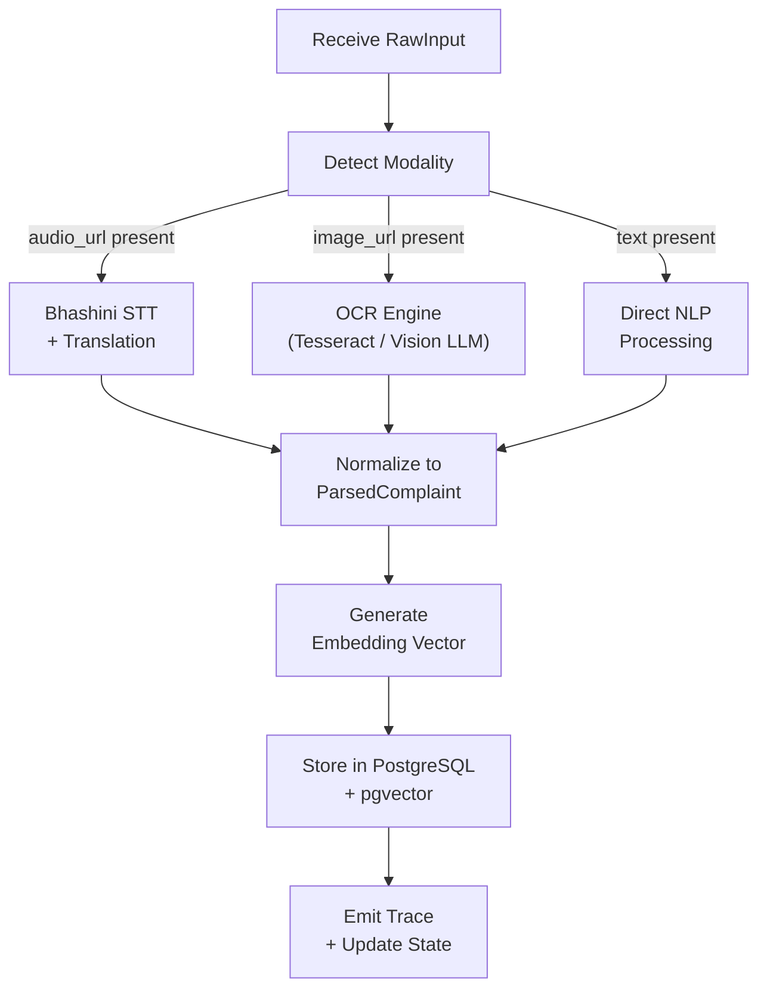
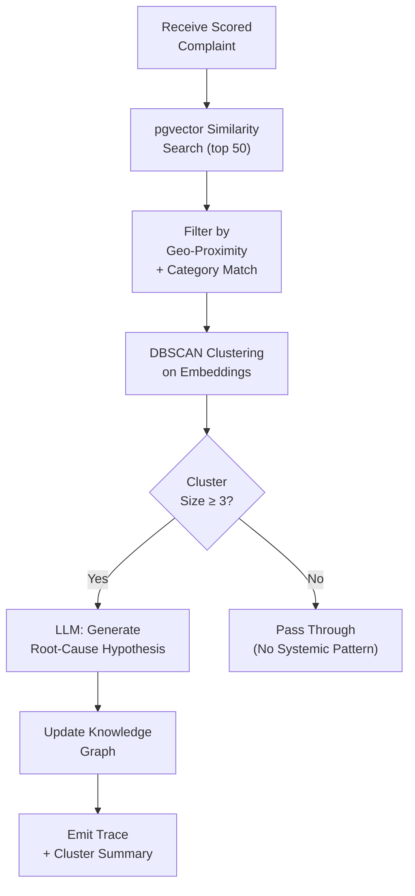
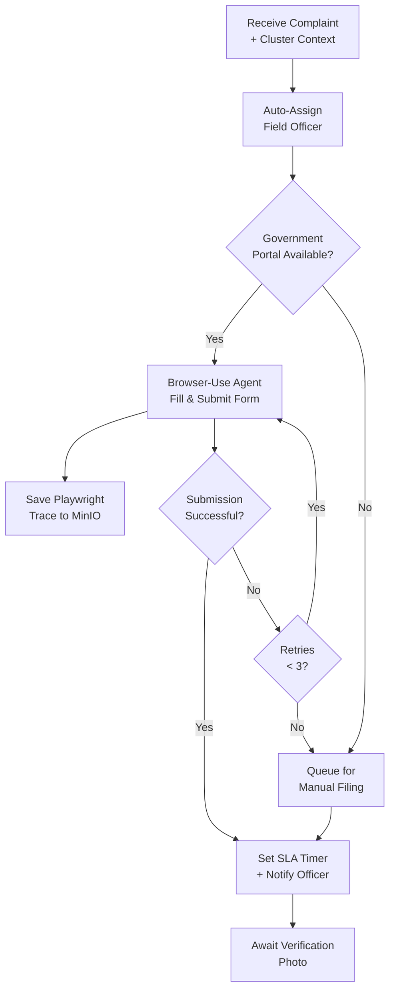
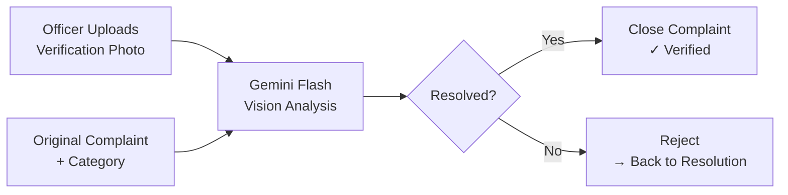

# Agent Swarm Specification

> **Project:** Civix-Pulse — Agentic Governance & Grievance Resolution Swarm
> **Team:** Vertex

---

## Overview

The Civix-Pulse agent swarm is implemented as a single LangGraph `StateGraph` with six specialized nodes. Each node is a self-contained Python module that receives typed state, performs its task, emits a structured reasoning trace, and returns updated state.

This document specifies each agent's purpose, inputs, outputs, reasoning schema, and failure modes.

---

## Shared State Schema

All agents operate on a shared `GrievanceState` object persisted to PostgreSQL via LangGraph checkpointing:

```python
from typing import TypedDict, Literal

class GrievanceState(TypedDict):
    complaint_id: str
    raw_input: RawInput
    parsed_complaint: ParsedComplaint | None
    priority: PriorityResult | None
    cluster: ClusterResult | None
    resolution: ResolutionResult | None
    verification: VerificationResult | None
    traces: list[AgentTrace]
    status: Literal[
        "ingesting", "triaging", "analyzing",
        "resolving", "verifying", "resolved",
        "rejected", "failed"
    ]
    retry_count: int
```

---

## Agent 1 — Ingestion Agent

### Purpose

Accepts raw multimodal input (text, audio, image) and produces a normalized `ParsedComplaint` object.

### Input

```python
class RawInput(TypedDict):
    source: Literal["whatsapp", "web", "ocr", "proactive"]
    text: str | None
    audio_url: str | None
    image_url: str | None
    location: dict | None        # {"lat": float, "lng": float}
    language: str                 # ISO 639-1 code
    citizen_id: str | None
```

### Processing Logic



### Output

```python
class ParsedComplaint(TypedDict):
    text_en: str                    # English text (translated if needed)
    text_original: str              # Original language text
    language_detected: str
    category: str                   # water, electricity, roads, sanitation, etc.
    subcategory: str
    location: dict
    embedding: list[float]          # 1536-dim vector
    media_urls: list[str]
    extracted_entities: dict        # ward, landmark, department mentions
```

### Failure Modes

| Failure | Handling |
|---|---|
| Bhashini API down | Fallback to Whisper local model |
| OCR unreadable | Flag for manual review; set `status: "failed"` |
| No text extractable | Log trace with `confidence: 0`; skip to manual queue |

---

## Agent 2 — Priority Agent

### Purpose

Scores each complaint using a multi-factor Impact Matrix and emits a structured prioritization with full reasoning.

### Impact Matrix

```
Priority Score = (Severity × 0.30) + (Blast Radius × 0.25) + (Vulnerability × 0.20)
                + (Sentiment Urgency × 0.15) + (Time Decay × 0.10)
```

| Factor | Range | Description |
|---|---|---|
| **Severity** | 1–10 | How dangerous or disruptive is the issue? |
| **Blast Radius** | 1–10 | How many people are affected? |
| **Vulnerability** | 1–10 | Are affected citizens elderly, disabled, low-income? |
| **Sentiment Urgency** | 1–10 | Emotional tone: desperate (10) vs. routine (1) |
| **Time Decay** | 1–10 | How long has this been unresolved? Increases over time. |

### LLM Prompt Strategy

Single structured-output call to Claude Sonnet:

```
You are the Priority Agent for a civic grievance system.

Given the following complaint, score each factor from 1–10 with a one-sentence justification.

Complaint: {parsed_complaint.text_en}
Category: {parsed_complaint.category}
Location: {parsed_complaint.location}

Respond in this exact JSON schema:
{
  "severity": {"score": int, "reason": str},
  "blast_radius": {"score": int, "reason": str},
  "vulnerability": {"score": int, "reason": str},
  "sentiment_urgency": {"score": int, "reason": str},
  "time_decay": {"score": int, "reason": str},
  "overall_score": float,
  "priority_level": "CRITICAL" | "HIGH" | "MEDIUM" | "LOW",
  "recommended_sla_hours": int
}
```

### Output

```python
class PriorityResult(TypedDict):
    overall_score: float            # 0.0 – 10.0
    priority_level: str             # CRITICAL, HIGH, MEDIUM, LOW
    factors: dict                   # Individual factor scores + reasons
    recommended_sla_hours: int
    vulnerability_flags: list[str]  # ["elderly", "disabled", "low_income"]
```

### Priority Thresholds

| Level | Score Range | SLA | Auto-Escalation |
|---|---|---|---|
| CRITICAL | 8.0 – 10.0 | 24 hours | Immediate: department head notified |
| HIGH | 6.0 – 7.9 | 72 hours | At 50% SLA elapsed |
| MEDIUM | 4.0 – 5.9 | 7 days | At 80% SLA elapsed |
| LOW | 0.0 – 3.9 | 14 days | On breach only |

---

## Agent 3 — Systemic Auditor

### Purpose

Performs cross-complaint correlation to detect systemic patterns and generate root-cause hypotheses. This is the intelligence differentiator — it turns 50 tickets into 1 insight.

### Processing Logic



### Clustering Parameters

| Parameter | Value | Rationale |
|---|---|---|
| Similarity threshold | cosine ≥ 0.82 | Balances recall vs. noise |
| Geo-radius filter | 2 km | Infrastructure typically affects a local area |
| DBSCAN `eps` | 0.18 | Tuned on seeded complaint data |
| DBSCAN `min_samples` | 3 | Minimum cluster size for a "systemic" finding |

### Output

```python
class ClusterResult(TypedDict):
    cluster_id: str | None
    cluster_size: int
    is_systemic: bool
    similar_complaints: list[str]       # complaint IDs
    root_cause_hypothesis: str | None   # LLM-generated narrative
    infrastructure_entity: str | None   # "Pump Station 7", "Feeder Line 4A"
    confidence: float
    recommended_action: str | None
```

### Knowledge Graph Update

When a systemic pattern is detected, the Auditor emits a graph update event:

```json
{
  "event": "graph_update",
  "nodes": [
    {"id": "cluster-047", "type": "root_cause", "label": "Pump Station 7 Failure"},
    {"id": "GRV-142", "type": "complaint", "label": "Low water pressure..."}
  ],
  "edges": [
    {"source": "GRV-142", "target": "cluster-047", "relation": "caused_by"}
  ]
}
```

---

## Agent 4 — Resolution Agent

### Purpose

Takes action on a complaint: assigns a field officer, files on the government portal via Browser-Use, and sets SLA tracking.

### Processing Logic



### Officer Assignment Logic

```python
def assign_officer(complaint: ParsedComplaint, cluster: ClusterResult) -> Officer:
    """
    Assignment priority:
    1. Officers in the same ward as the complaint.
    2. Officers in the relevant department (water, roads, etc.).
    3. Lowest current workload (fewest open assignments).
    4. If systemic: assign to a senior officer with cluster context.
    """
```

### Browser-Use Configuration

| Parameter | Value |
|---|---|
| Target | Mock BWSSB portal (Flask app) |
| Navigation mode | Accessibility tree first, screenshot fallback |
| LLM driver | Claude Sonnet |
| Max retries | 3 |
| Session recording | Playwright trace → MinIO |
| Timeout | 60 seconds per attempt |

### Output

```python
class ResolutionResult(TypedDict):
    assigned_officer_id: str
    portal_submission_id: str | None
    portal_filing_status: str       # "submitted", "failed", "manual_queue"
    playwright_trace_url: str | None
    sla_deadline: str               # ISO-8601 timestamp
    sla_hours: int
```

---

## Agent 5 — Proactive Sensor Agent

### Purpose

Detects infrastructure problems from satellite imagery and CCTV footage before citizens report them. Auto-files grievances attributed to the sensor.

### Input Sources

| Source | Format | Detection Model |
|---|---|---|
| Sentinel-2 satellite | Before/after image pair | Grounding DINO (zero-shot object detection) |
| CCTV footage | 30-second video clip | Gemini Flash (video analysis) |

### Detection Prompts

**Satellite (Grounding DINO):**
```
Detect: "garbage pile", "waterlogging", "road damage", "construction debris"
```

**CCTV (Gemini Flash):**
```
Analyze this CCTV footage. Identify any visible civic issues:
- Waterlogging or flooding
- Open manholes
- Garbage accumulation
- Road damage or potholes
- Fallen trees or debris

For each detection, provide: issue type, severity (1-10), approximate location in frame, confidence score.
```

### Output

Detected issues are converted to `RawInput` objects with `source: "proactive"` and fed into the standard Ingestion Agent pipeline.

---

## Agent 6 — Verification Agent

### Purpose

Validates that a resolved complaint is actually fixed by comparing the officer's verification photo against the original complaint context.

### Processing Logic



### Vision Prompt

```
You are a civic infrastructure verification agent.

Original complaint: "{complaint_text}"
Category: {category}

The field officer claims this issue is resolved and submitted the attached photo as proof.

Analyze the photo and determine:
1. Is the issue visibly resolved? (yes/no)
2. Confidence score (0.0 – 1.0)
3. One-sentence justification.

Respond as JSON: {"resolved": bool, "confidence": float, "reason": str}
```

### Output

```python
class VerificationResult(TypedDict):
    resolved: bool
    confidence: float
    reason: str
    photo_url: str
    verified_at: str            # ISO-8601
```

---

## Inter-Agent Communication

Agents do not communicate directly. All communication flows through the shared `GrievanceState` object managed by LangGraph:

```
Agent A writes to state → LangGraph persists checkpoint → Agent B reads from state
```

Real-time dashboard updates are a side-effect: each agent publishes an event to Redis pub/sub after updating state.

```python
async def emit_trace(state: GrievanceState, agent: str, trace: AgentTrace):
    """Publish agent trace to Redis for dashboard streaming."""
    state["traces"].append(trace)
    await redis.publish("agent_events", json.dumps({
        "event": "agent_status_change",
        "data": {
            "complaint_id": state["complaint_id"],
            "agent": agent,
            "status": state["status"],
            "trace": trace
        }
    }))
```

---

## References

- [Architecture](ARCHITECTURE.md) — System design and data flow diagrams.
- [API Spec](API_SPEC.md) — Endpoints that trigger and query the swarm.
- [TRD](TRD.md) — Scalability and audit trail requirements.
- [Feature Roadmap](features.md) — Feature tier assignments for each agent.
