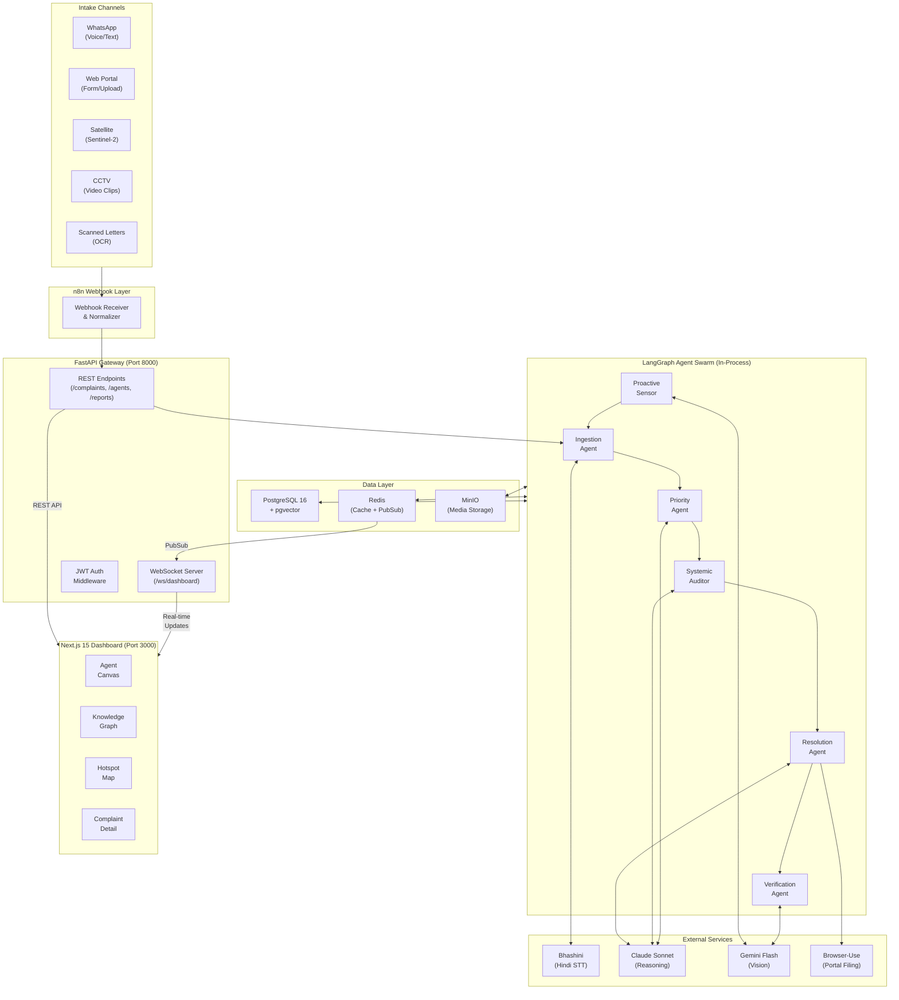
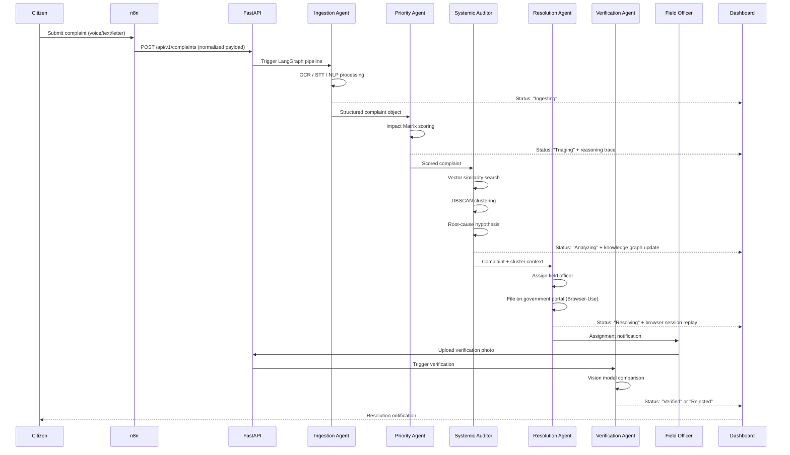
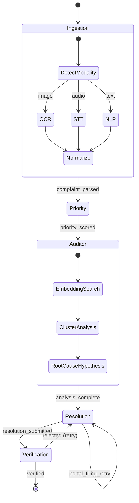
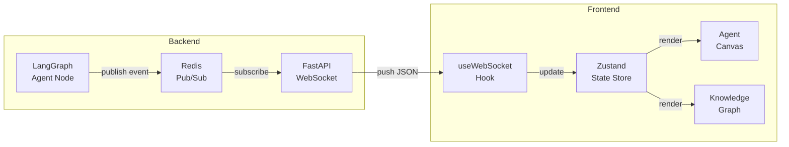
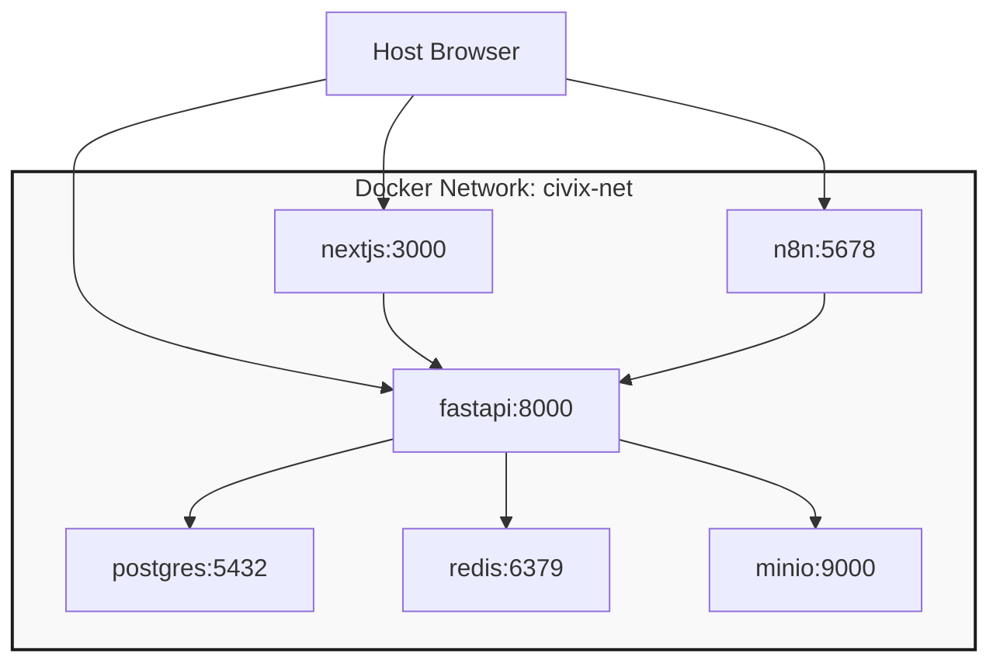
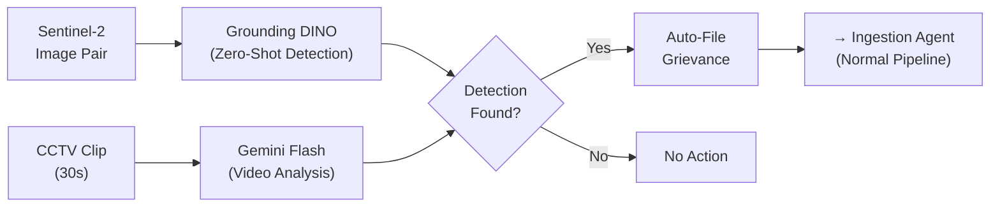

# System Architecture

> **Project:** Civix-Pulse — Agentic Governance & Grievance Resolution Swarm
> **Team:** Vertex

---

## 1. High-Level Architecture

The system follows a **source → ingest → process → act → verify** pipeline, with real-time feedback to the dashboard at every stage.



---

## 2. Data Flow — Complaint Lifecycle

A single complaint passes through the following stages from intake to verified resolution:



---

## 3. LangGraph State Machine

The agent swarm is implemented as a single LangGraph `StateGraph` with conditional edges:



**Key design decisions:**

- **Cyclic edges:** Resolution → Verification → Resolution allows retry loops for rejected verifications.
- **Resolution self-loop:** Portal filing retries up to 3 times before falling back to manual assignment.
- **State persistence:** LangGraph checkpoints every node transition to PostgreSQL. Crash at any point → resume from last checkpoint.

---

## 4. Real-Time Dashboard Architecture

The dashboard receives real-time updates via WebSocket, driven by Redis pub/sub:



**Event schema pushed to dashboard:**

```json
{
  "event": "agent_status_change",
  "data": {
    "complaint_id": "GRV-2026-00142",
    "agent": "systemic_auditor",
    "status": "processing",
    "payload": {
      "cluster_size": 47,
      "root_cause": "Pump Station 7 pressure drop",
      "confidence": 0.89
    }
  }
}
```

---

## 5. Network Topology (Docker Compose)



**Exposed ports:** Only `3000` (dashboard), `8000` (API), and `5678` (n8n) are mapped to the host. Database, cache, and storage are internal-only.

---

## 6. Proactive Sensing Pipeline

The Proactive Sensor Agent operates on a separate trigger (scheduled or manual) rather than citizen-initiated:



Detected issues enter the standard pipeline as grievances attributed to `source: proactive_sensor`.

---

## 7. Security Boundaries

```
┌─────────────────────────────────────────────────────────┐
│                    Public Internet                       │
│                                                         │
│  ┌──────────┐  ┌──────────┐  ┌──────────┐              │
│  │ Port 3000│  │ Port 8000│  │ Port 5678│              │
│  │ Next.js  │  │ FastAPI  │  │ n8n      │              │
│  └────┬─────┘  └────┬─────┘  └────┬─────┘              │
│       │    JWT Auth  │             │                    │
├───────┼──────────────┼─────────────┼────────────────────┤
│       │  Docker Internal Network   │                    │
│       │              │             │                    │
│  ┌────┴──────────────┴─────────────┴────┐               │
│  │  PostgreSQL │  Redis  │  MinIO       │               │
│  │  (No external access)               │               │
│  └──────────────────────────────────────┘               │
└─────────────────────────────────────────────────────────┘
```

---

## 8. References

- [Agent Swarm](AGENT_SWARM.md) — Detailed specifications for each LangGraph node.
- [API Spec](API_SPEC.md) — Endpoint contracts and payload schemas.
- [TRD](TRD.md) — Scalability and data governance requirements.
- [Tech Stack](TECHSTACK.md) — Technology selection rationale.
- [Feature Roadmap](features.md) — Feature scope and build order.
