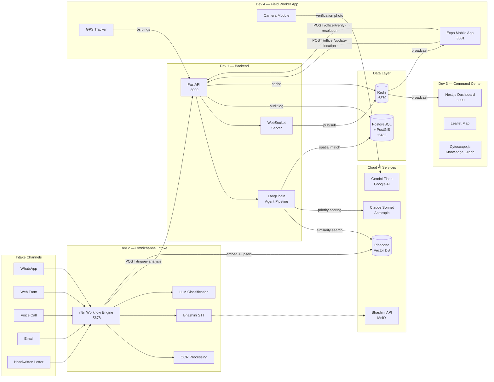
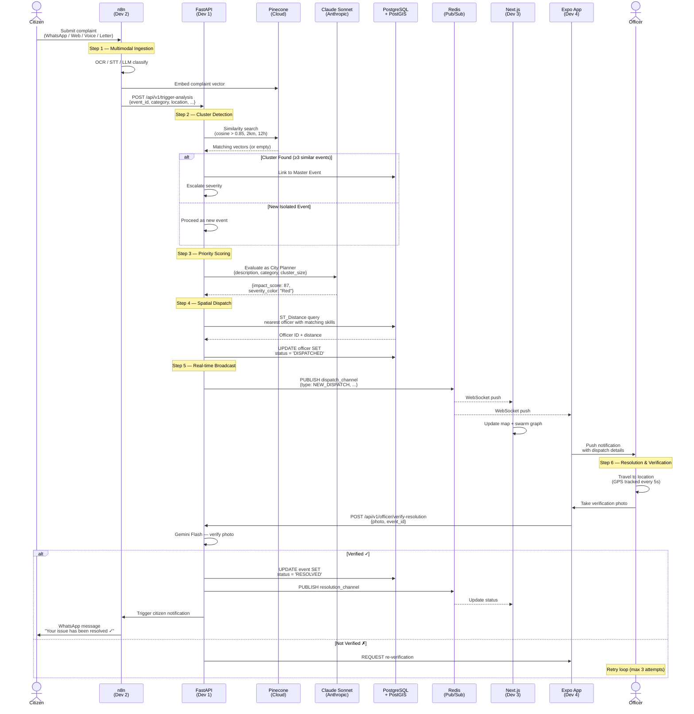
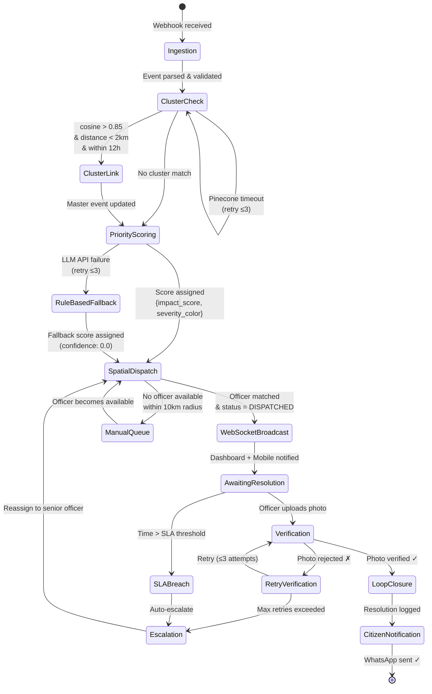
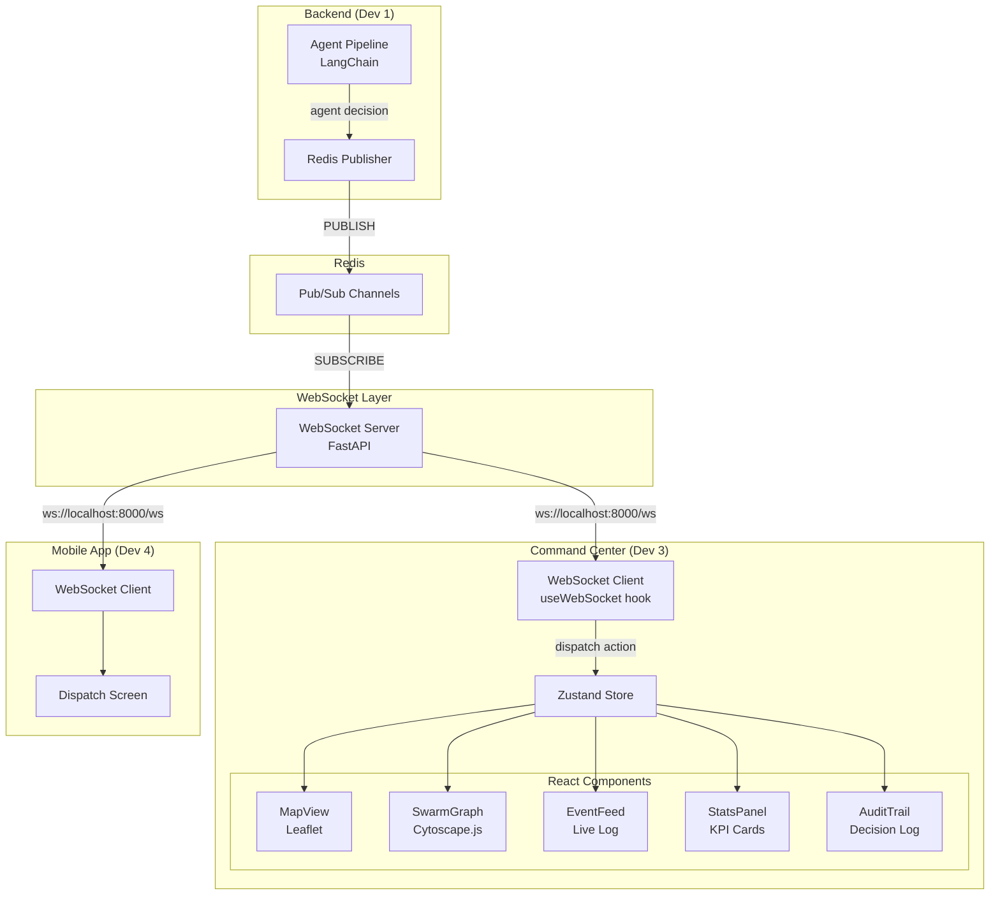
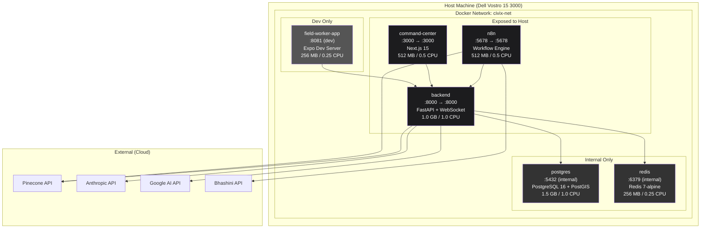
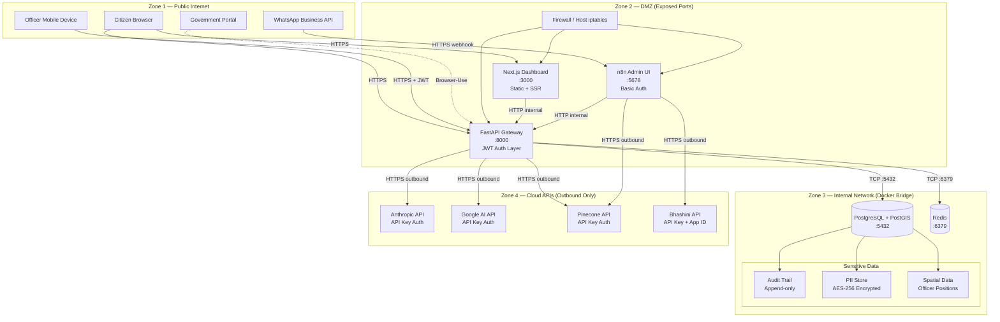

# System Architecture

**Project:** Civix-Pulse — Agentic Governance & Grievance Resolution Swarm  
**Version:** 1.0  
**Last Updated:** 2025-07-12

> Related docs: [TRD.md](./TRD.md) · [TECHSTACK.md](./TECHSTACK.md) · [AGENT_SWARM.md](./AGENT_SWARM.md) · [API_SPEC.md](./API_SPEC.md) · [features.md](./features.md)

---

## Table of Contents

1. [High-Level Architecture](#1-high-level-architecture)
2. [Complaint Lifecycle](#2-complaint-lifecycle)
3. [Swarm State Machine](#3-swarm-state-machine)
4. [Real-Time Dashboard Architecture](#4-real-time-dashboard-architecture)
5. [Docker Compose Network Topology](#5-docker-compose-network-topology)
6. [Security Boundaries](#6-security-boundaries)

---

## 1. High-Level Architecture

Four developer domains, connected through a centralized FastAPI backend. All heavy AI inference is offloaded to cloud APIs. Data flows left-to-right from citizen intake to officer resolution.



### Domain Ownership

| Domain | Owner | Responsibilities | Dependencies |
|---|---|---|---|
| `omnichannel-intake/` | Dev 2 | n8n workflows, Pinecone ingestion, LLM prompts, OCR/STT | Bhashini API, Pinecone, n8n |
| `backend/` | Dev 1 | FastAPI server, LangChain swarm logic, PostGIS queries, WebSocket | PostgreSQL, Redis, Pinecone, Claude |
| `command-center/` | Dev 3 | Next.js dashboard, Leaflet map, Cytoscape knowledge graph | WebSocket (from backend), Redis |
| `field-worker-app/` | Dev 4 | Expo mobile app, camera verification, GPS tracking | REST API (backend), Gemini Flash |

---

## 2. Complaint Lifecycle

The complete journey of a citizen complaint through the system — from intake to verified resolution. Every numbered step produces an audit record (see [TRD.md §2.2](./TRD.md#22-audit-trail-requirements)).



### Lifecycle States

| State | Trigger | Next State |
|---|---|---|
| `RECEIVED` | Complaint ingested by n8n | `ANALYZING` |
| `ANALYZING` | Webhook hits FastAPI | `CLUSTERED` or `PRIORITIZED` |
| `CLUSTERED` | Linked to existing master event | `PRIORITIZED` |
| `PRIORITIZED` | Impact score assigned | `DISPATCHED` |
| `DISPATCHED` | Officer assigned via spatial match | `IN_PROGRESS` |
| `IN_PROGRESS` | Officer en route / on site | `PENDING_VERIFICATION` |
| `PENDING_VERIFICATION` | Officer uploads photo | `RESOLVED` or `RETRY_VERIFICATION` |
| `RESOLVED` | Photo verified by Gemini Flash | Terminal |
| `ESCALATED` | SLA breach or verification failure (3×) | Routed to `department_head` |

---

## 3. Swarm State Machine

The agent swarm operates as a finite state machine. Each node is an agent. Edges represent transitions triggered by the previous agent's output. Retry edges handle transient failures. See [AGENT_SWARM.md](./AGENT_SWARM.md) for agent-level detail.



### Agent Registry

| Agent | Type | Model | Timeout | Fallback |
|---|---|---|---|---|
| Ingestion Agent | Rule-based | — | 5s | Reject malformed payload |
| Cluster Agent | Hybrid (Pinecone + rules) | — | 10s | Skip clustering, proceed as new |
| Priority Agent | LLM-driven | Claude Sonnet | 15s | Rule-based scoring matrix |
| Spatial Matchmaker | Rule-based (SQL) | — | 5s | Expand search radius |
| Verification Agent | LLM-driven (vision) | Gemini Flash | 10s | Manual verification queue |
| Resolution Agent | Rule-based | — | 5s | — |

---

## 4. Real-Time Dashboard Architecture

Events flow from agent decisions through Redis pub/sub to the React dashboard in real-time. The architecture supports multiple concurrent dashboard sessions and the mobile app without additional WebSocket connections to the backend per client.



### WebSocket Event Schema

All WebSocket messages follow a consistent envelope:

```typescript
interface WebSocketEvent {
  type: 'NEW_EVENT' | 'CLUSTER_DETECTED' | 'PRIORITY_SCORED' | 'NEW_DISPATCH' | 'OFFICER_LOCATION' | 'VERIFICATION_RESULT' | 'RESOLUTION_COMPLETE';
  timestamp: string;       // ISO 8601
  event_id: string;        // EVT-YYYY-NNNNN
  payload: Record<string, unknown>;
  signature: string;       // HMAC-SHA256
}
```

### Zustand Store Slices

| Slice | State | Updated By |
|---|---|---|
| `events` | Map of event_id → EventData | `NEW_EVENT`, `CLUSTER_DETECTED`, `RESOLUTION_COMPLETE` |
| `officers` | Map of officer_id → OfficerData | `NEW_DISPATCH`, `OFFICER_LOCATION` |
| `swarmGraph` | Cytoscape elements (nodes + edges) | All agent decision events |
| `stats` | Aggregated KPIs (counts, averages) | Computed from `events` on each update |
| `auditLog` | Ordered list of audit records | All events (appended) |

---

## 5. Docker Compose Network Topology

All services run on a single Docker bridge network (`civix-net`). Only three ports are exposed to the host machine. Internal services communicate via Docker DNS hostnames.



### Port Mapping

| Service | Container Port | Host Port | Protocol | Access |
|---|---|---|---|---|
| `backend` | 8000 | 8000 | HTTP + WebSocket | Public (API + WS) |
| `command-center` | 3000 | 3000 | HTTP | Public (Dashboard) |
| `n8n` | 5678 | 5678 | HTTP | Admin only |
| `postgres` | 5432 | — | TCP | Internal only |
| `redis` | 6379 | — | TCP | Internal only |
| `field-worker-app` | 8081 | 8081 | HTTP | Dev only |

### Docker Compose Service Dependencies

```yaml
# Startup order enforced by depends_on + healthcheck
services:
  postgres:    # starts first — no dependencies
  redis:       # starts first — no dependencies
  backend:     # depends_on: postgres, redis
  n8n:         # depends_on: backend (webhook target must be up)
  command-center:  # depends_on: backend (WebSocket source)
  field-worker-app: # depends_on: backend (API target)
```

---

## 6. Security Boundaries

Defense in depth — three concentric security zones. Untrusted traffic enters through the public zone, is authenticated at the API gateway, and only reaches internal services through the backend.



### Security Controls by Zone

| Zone | Controls | Details |
|---|---|---|
| **Zone 1 — Public** | TLS termination, rate limiting | All traffic over HTTPS. Rate limit: 100 req/min per IP on API endpoints. |
| **Zone 2 — DMZ** | JWT authentication, RBAC, input validation | Every API request authenticated via JWT bearer token. Role-based endpoint access (see [TRD.md §4.2](./TRD.md#42-role-based-access-control)). Pydantic v2 validates all request bodies. |
| **Zone 3 — Internal** | Network isolation, encryption at rest, append-only audit | PostgreSQL and Redis are not exposed to the host. PII encrypted with AES-256. Audit table has `INSERT`-only grants. No `UPDATE`/`DELETE` on audit records. |
| **Zone 4 — Cloud** | API key rotation, outbound-only | API keys stored as Docker secrets / environment variables. No inbound traffic from cloud APIs. Keys rotated every 90 days. |

### Threat Model Summary

| Threat | Mitigation |
|---|---|
| Unauthorized API access | JWT with 24h expiry + RBAC enforcement on every endpoint |
| SQL injection | Parameterized queries via SQLAlchemy ORM / asyncpg |
| XSS on dashboard | React default output encoding + CSP headers |
| Compromised verification photo | SHA-256 hash at upload, verified before AI analysis |
| Audit trail tampering | Append-only table, no UPDATE/DELETE grants, immutable records |
| PII exposure in logs | Tier 1 PII masked in application logs, never stored in Pinecone |
| Replay attacks on webhook | Idempotency-Key header with 24h Redis dedup window |
| Man-in-the-middle | TLS everywhere (external HTTPS, internal Docker network encryption optional) |

---

*For technology selection rationale, see [TECHSTACK.md](./TECHSTACK.md). For technical constraints and data governance, see [TRD.md](./TRD.md). For agent-level behavior specifications, see [AGENT_SWARM.md](./AGENT_SWARM.md).*
