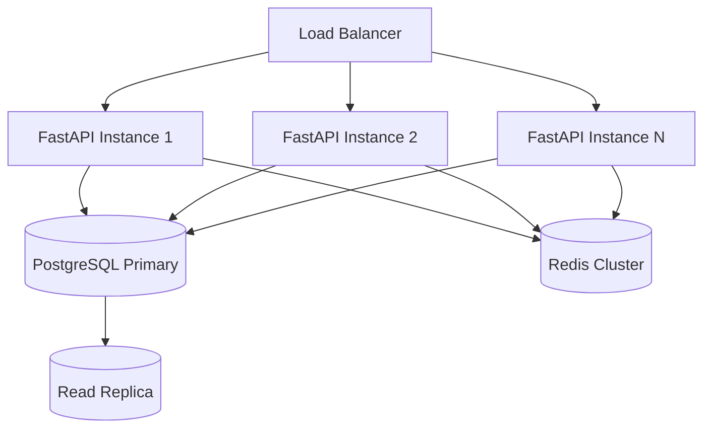

# Technical Requirements Document (TRD)

> **Project:** Civix-Pulse — Agentic Governance & Grievance Resolution Swarm
> **Team:** Vertex
> **Version:** 1.0

---

## 1. Overview

This document specifies the technical requirements for Civix-Pulse, focusing on system scalability, data governance, audit compliance, and infrastructure constraints. It complements the [PRD](PRD.md) (product scope) and [ARCHITECTURE](ARCHITECTURE.md) (system design).

---

## 2. System Architecture Constraints

### 2.1 Deployment Model

| Environment | Configuration |
|---|---|
| **Local Development** | Docker Compose on a single machine (8GB RAM, 4-core CPU, 256GB SSD). |
| **Demo / Hackathon** | Same Docker Compose stack, pre-seeded with 60 realistic complaints. |
| **Production (Roadmap)** | Kubernetes with horizontal pod autoscaling per service. |

### 2.2 Service Boundaries

The system is composed of four independently deployable services:

```
┌─────────────────┐  ┌──────────────────┐  ┌──────────────┐  ┌───────────┐
│  Next.js 15     │  │  FastAPI Gateway  │  │  LangGraph   │  │  n8n      │
│  (Frontend)     │  │  (API Layer)      │  │  (Agent Core)│  │  (Webhooks│
│  Port 3000      │  │  Port 8000        │  │  In-process   │  │  Port 5678│
└─────────────────┘  └──────────────────┘  └──────────────┘  └───────────┘
                              │                    │
                     ┌────────┴────────────────────┘
                     ▼
           ┌──────────────────┐  ┌──────────┐  ┌──────────┐
           │  PostgreSQL 16   │  │  Redis    │  │  MinIO   │
           │  + pgvector      │  │  (Cache)  │  │  (Object │
           │  Port 5432       │  │  Port 6379│  │  Storage) │
           └──────────────────┘  └──────────┘  └──────────┘
```

### 2.3 LangGraph In-Process Constraint

LangGraph runs **in-process within the FastAPI service**, not as a separate microservice. This is intentional:

- Eliminates network latency between API layer and agent orchestration.
- Simplifies Docker Compose topology.
- LangGraph's state persistence uses the shared PostgreSQL instance.

---

## 3. Data Governance

### 3.1 Data Classification

| Classification | Examples | Handling |
|---|---|---|
| **PII** | Citizen name, phone number, address, UPI ID | Encrypted at rest (AES-256). Access restricted to Resolution Agent and admin roles. |
| **Complaint Content** | Complaint text, OCR output, transcriptions | Stored in PostgreSQL. Retained for audit. |
| **Media** | Photos, voice recordings, verification images | Stored in MinIO (S3-compatible). Pre-signed URLs for access. |
| **Agent Logs** | Reasoning traces, decision logs, confidence scores | Append-only table. Immutable after write. No deletion permitted. |
| **Infrastructure Data** | Ward maps, department rosters, asset inventories | Public or internal classification. No encryption required. |

### 3.2 Audit Trail Requirements

Every agent decision must produce an audit record with the following schema:

```json
{
  "trace_id": "uuid-v4",
  "agent": "priority_agent",
  "timestamp": "2026-04-17T07:30:00Z",
  "complaint_id": "GRV-2026-00142",
  "inputs": { "text": "...", "sentiment_score": 0.87 },
  "reasoning": "Impact score elevated due to vulnerability flags (elderly, low-income) and 23 similar complaints in 48h window.",
  "output": { "priority": "CRITICAL", "score": 8.2 },
  "confidence": 0.91,
  "model": "claude-sonnet-4-20250514",
  "latency_ms": 1240
}
```

**Immutability:** Audit records are INSERT-only. No UPDATE or DELETE operations are permitted on the `agent_traces` table. This is enforced at the database level via a trigger that rejects mutations.

### 3.3 Data Retention

| Data Type | Retention Period | Justification |
|---|---|---|
| Complaint records | Indefinite | Legal requirement for public records. |
| Agent traces | Indefinite | Audit compliance. |
| Media files | 1 year | Storage optimization; metadata retained indefinitely. |
| Session/cache data | 24 hours | Ephemeral by nature. |

---

## 4. Scalability Requirements

### 4.1 Load Profile (Production Roadmap)

| Metric | Target |
|---|---|
| Concurrent complaints in pipeline | 500 |
| Complaints ingested per day | 10,000 |
| Agent pipeline latency (p95) | < 30 seconds |
| API response time (p95) | < 500ms |
| Knowledge graph query time | < 2 seconds |
| Vector similarity search (pgvector) | < 200ms for top-50 results |

### 4.2 Horizontal Scaling Strategy



- **FastAPI + LangGraph:** Stateless per-request. Scale horizontally behind a load balancer.
- **PostgreSQL:** Single primary with read replicas for dashboard queries.
- **Redis:** Used for agent state caching and pub/sub for real-time WebSocket events.
- **MinIO:** S3-compatible; scales independently for media storage.

### 4.3 Local Hardware Optimization

Target hardware: Dell Vostro 15 3000 (8GB RAM, 4-core i5, 256GB SSD).

| Service | Memory Limit | CPU Limit |
|---|---|---|
| PostgreSQL + pgvector | 1.5 GB | 1 core |
| Redis | 256 MB | 0.25 core |
| MinIO | 256 MB | 0.25 core |
| FastAPI + LangGraph | 2 GB | 1.5 cores |
| Next.js | 512 MB | 0.5 core |
| n8n | 512 MB | 0.5 core |
| **Total** | **~5 GB** | **4 cores** |

Leaves ~3GB for the OS and Docker daemon overhead.

---

## 5. Security Requirements

### 5.1 Authentication & Authorization

| Layer | Mechanism |
|---|---|
| **API Gateway** | JWT-based authentication. Tokens issued on login, validated per request. |
| **Role-Based Access** | Roles: `citizen`, `officer`, `department_head`, `admin`. Permissions scoped per role. |
| **Inter-Service** | Services communicate over Docker internal network. No external exposure except frontend and API gateway. |

### 5.2 Input Validation

- All API inputs validated via Pydantic models with strict type enforcement.
- File uploads restricted to allowed MIME types and size limits (10MB images, 25MB audio).
- SQL injection prevention via parameterized queries (SQLAlchemy ORM).
- XSS prevention via Next.js built-in output escaping.

### 5.3 Content Integrity

- Perceptual hashing on uploaded photos to detect re-use of previously submitted images.
- AI-image classifier for synthetic content detection (deepfake guard).
- Playwright session traces provide tamper-proof audit logs for browser automation.

---

## 6. Integration Specifications

### 6.1 External APIs

| Service | Purpose | Fallback |
|---|---|---|
| **Bhashini** | Hindi STT + translation | Whisper (local) or Google STT |
| **Anthropic (Claude)** | Agent reasoning, structured output | Gemini Pro |
| **Google AI (Gemini Flash)** | Vision verification, video analysis | Claude Vision |
| **Sentinel Hub** | Satellite imagery access | Pre-cached image pairs |
| **Browser-Use** | Computer-use agent for portal filing | Pre-recorded session replay |

### 6.2 n8n Webhook Contracts

n8n receives intake from external channels and forwards to FastAPI:

```json
{
  "source": "whatsapp | web | ocr | proactive",
  "payload": {
    "text": "string | null",
    "audio_url": "string | null",
    "image_url": "string | null",
    "location": { "lat": 12.9716, "lng": 77.5946 },
    "language": "hi | en",
    "citizen_id": "string | null"
  },
  "metadata": {
    "received_at": "ISO-8601",
    "channel_message_id": "string"
  }
}
```

---

## 7. Testing Strategy

| Level | Tool | Scope |
|---|---|---|
| **Unit** | pytest (backend), Jest (frontend) | Individual agent nodes, API handlers, UI components. |
| **Integration** | pytest + httpx | End-to-end agent pipeline with mocked LLM responses. |
| **Contract** | Pydantic model validation | API request/response schema compliance. |
| **Visual** | Playwright | Dashboard rendering, agent canvas interactions. |

---

## 8. References

- [PRD](PRD.md) — Product requirements and social impact thesis.
- [Architecture](ARCHITECTURE.md) — System design and data flow diagrams.
- [Agent Swarm](AGENT_SWARM.md) — LangGraph node specifications.
- [API Spec](API_SPEC.md) — Endpoint contracts.
- [Feature Roadmap](features.md) — Tier-wise feature breakdown.
